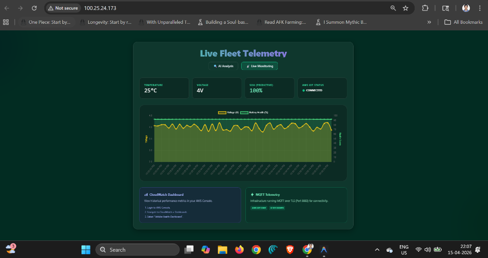
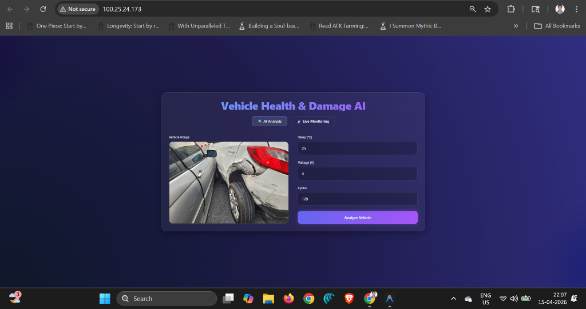
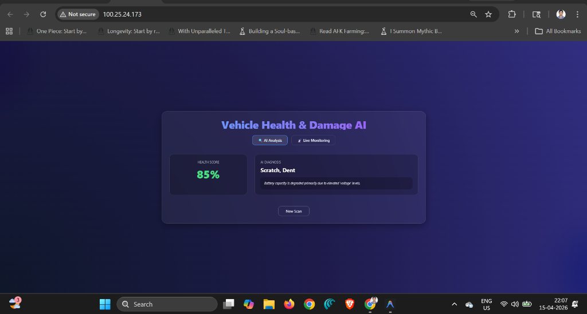

# AI-Based Vehicle Health Monitoring & Damage Detection System 🚗🔋


An end-to-end telematics and computer vision platform. This system integrates real-time IoT battery telemetry with Vision AI to provide a comprehensive view of vehicle health, including both internal sensor data and external damage assessment.

---

## 🌟 Dashboard Showcase

### 🛰️ Real-Time IoT Telemetry Tracking
Our live monitoring dashboard tracks high-frequency sensor data (Voltage, Temperature, cycles) streaming through AWS IoT Core.



### 🧠 Vision AI Damage Analysis
The "AI Analysis" module allows users to upload vehicle images for instant structural damage assessment using YOLOv8 computer vision.

| Image Upload | Diagnostic Result |
| :--- | :--- |
|  |  |

---

## 🚀 The Data Journey (How it Works)

### 1. The IoT Pipeline (Live Telemetry)
1.  **Vehicle Simulator**: A custom `iot_simulator.js` script mimics a vehicle's On-Board Diagnostic (OBD) system, publishing telemetry via **MQTT (Port 8883/TLS)** to **AWS IoT Core**.
2.  **AWS IoT Rule**: Detects incoming messages on the `vehicle/telemetry` topic and triggers an **AWS Lambda**.
3.  **Lambda Processor**: A Node.js 20.x function (using AWS SDK v3) validates the data, persists it to **DynamoDB**, and forwards it to the **Backend Webhook**.
4.  **Live Updates**: The Express server bridges the webhook data to the Angular frontend via **Socket.IO**, reflecting updates on the dashboard instantly.

### 2. The AI Engine (Damage & Health)
- **Computer Vision**: A custom **YOLOv8** model identifies dents, scratches, and structural damage in uploaded photos.
- **Predictive Analytics**: An **XGBoost** regression model calculates the **State of Health (SOH)** of the battery based on historical discharge cycles and current voltage/temperature trends.

---


## 💻 Local Quick Start

### 1. Prerequisites
- Node.js 20+
- Python 3.10+
- AWS CLI configured with valid credentials

### 2. Installation
```powershell
# Clone the repository
git clone https://github.com/InfantShervin/AI-Based-Vehicle-Health-Monitoring-Damage-Detection-System.git
cd AI-Based-Vehicle-Health-Monitoring-Damage-Detection-System

# Install Backend & Simulator
cd backend && npm install
cd ../scripts && npm install
```

### 3. Running the Simulator
To feed live data into your dashboard, run the simulator:
```powershell
# Run in AWS Mode (Production)
$env:USE_AWS="true"; $env:AWS_IOT_ENDPOINT="your-ats.iot.region.amazonaws.com"; node scripts/iot_simulator.js
```

---

## ☁️ Deployment Stack
- **Infrastructure**: Managed via **Terraform** (EC2, Lambda, IAM Roles, Security Groups).
- **CI/CD**: Automated via **Jenkins** pipeline (`Jenkinsfile`).
- **Provisioning**: **Ansible** playbooks for Docker orchestration and disk volume management.

---

## 📜 Repository Structure
- `frontend/`: Angular 17+ standalone source code.
- `backend/`: Node.js Express API and WebSocket bridge.
- `ml-service/`: FastAPI server for YOLOv8 and XGBoost predictions.
- `scripts/`: IoT Simulator and testing tools.
- `terraform/`: Infrastructure as Code (IaC) definitions.

---
